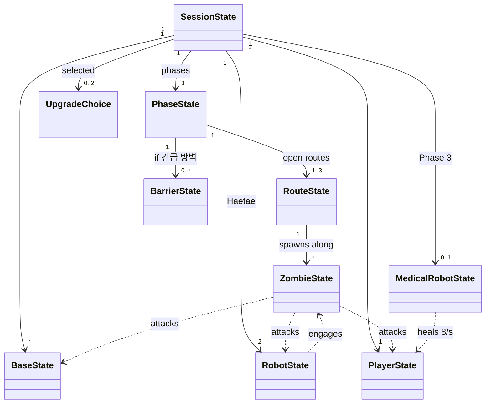
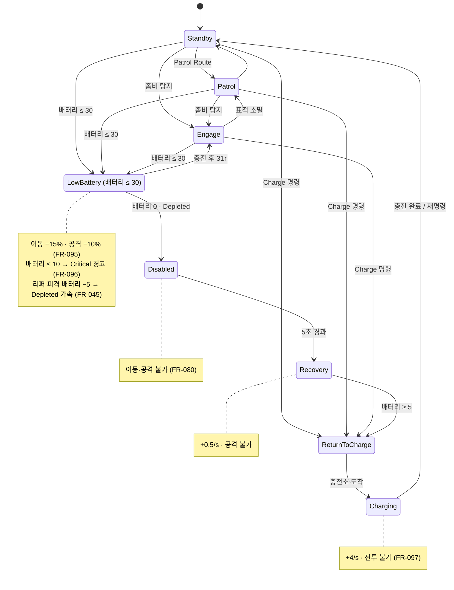

# Data Model: 「텔레 로봇팀, 출격하라」 MVP

**Feature**: `001-robot-base-defense-mvp` | **Date**: 2026-06-27 | **Plan**: [plan.md](./plan.md)

All tunable values live in **ScriptableObject data assets** (Constitution II) that map to **plain config structs** consumed by the pure `Game.Core` (Constitution III). Values cite their spec FR; values labeled **(PLANNING — to balance)** are introduced by the plan (see research.md §4–5) and are not spec-derived. Runtime/simulation entity state is held in pure C# state objects driven by the core.

---

## Data assets (ScriptableObject definitions)

### GameConfig
| Field | Value | Source |
|-------|-------|--------|
| playerMaxHp | 100 | FR-017 |
| baseMaxHp | 1000 | FR-020 |
| basePhaseRecoveryPct | 0.15 (15%) | FR-021 |
| baseWarningPct | 0.30 (≤30%) | FR-023, FR-125 |
| targetSessionMinutes | 10–15 | FR-006, SC-001 |
| simFixedStepSeconds | 1/60 (tunable) | research.md §3 |

### WeaponDef (Assault Rifle)
| Field | Value | Source |
|-------|-------|--------|
| baseDamage | 30 | FR-012 |
| headshotMultiplier | 2.5 | FR-013 |
| magazineSize | 30 | FR-014 |
| reloadSeconds | 2 | FR-015 |
| startGrenades | 2 (reset each phase) | FR-018, Assumptions |
Validation: Runner body ≈3 hits, head 1–2 (FR-042 sanity); headshot applies only to head-hitbox zombies, not robots (Assumptions).

### GrenadeDef **(PLANNING — to balance)**
| Field | Value | Source |
|-------|-------|--------|
| radiusMeters | 5 | research.md §4 |
| centerDamage | 150 | research.md §4 |
| innerFullDamageRadiusMeters | 2 | research.md §4 |
| edgeDamageAtRadius | 60 (at 5 m) | research.md §4 |
| falloff | linear 150→60 between 2 m→5 m | research.md §4 |
| maxAffectedZombies | 10 | research.md §4 |
| affects | zombies only | research.md §4 |

### BaseConfig
maxHp 1000 (FR-020); phaseRecoveryPct 0.15 (FR-021); no player repair (FR-022); warning ≤30% (FR-023); defeat at 0 (FR-024). **Damage dealt to the base lives on `ZombieDef.baseDamage` only** (single source of truth — do not duplicate zombie damage numbers here, to avoid tuning drift).

### RouteDef ×3
| Field | North Road | East Alley | South Tunnel |
|-------|-----------|-----------|--------------|
| id | NorthRoad | EastAlley | SouthTunnel |
| openPhase | 1 | 2 | 3 |
| character | wide, high readability, larger groups (FR-032) | shorter, faster base pressure (FR-033) | limited sightlines, Ripper-favored (FR-034) |
| waypoints | ordered list → base | ordered list → base | ordered list → base |
| chokeAnchor | base-side entry point | base-side entry point | base-side entry point |
All routes converge on the central base (FR-025, FR-030). Waypoints are the authoritative path/progression model (research.md §3).

### ZombieDef ×3
| Field | Runner | Bruiser | Ripper |
|-------|--------|---------|--------|
| hp | 90 | 500 | 180 |
| moveSpeed | fast | slow | fast |
| baseDamage | 8 | 60 | 10 |
| playerDamage | 12 | 30 | 18 |
| robotDamage (qualitative, spec) | low | medium | medium |
| **robotDamageNumeric** (PLANNING — to balance) | 5 | 25 | 20 |
| targetPriority | base > player > robot | base > robot > player | robot > player > base |
| threatCost | 1 | 5 | 4 |
| **attackIntervalSeconds** (PLANNING — to balance) | 1.0 | 1.5 | 1.0 |
| **attackMode** | RepeatedUntilKilled | RepeatedUntilKilled | RepeatedUntilKilled |
| **targetAttackRange** (PLANNING — to balance) | melee | melee | melee |
| special | — | — | +5 robot battery drain per hit (FR-045) |
| firstAppears | Phase 1 | Phase 2 | Phase 3 |
| distinct A/V | — | — | required (FR-047): special icon + voice callout |
Source: FR-040..047, FR-052. Only these 3 types (FR-040, FR-140).

**Attack semantics** (resolves data-model ambiguity): a zombie that reaches its current target (base/player/robot) attacks **repeatedly** every `attackIntervalSeconds` for that type's damage until it is killed or the target is destroyed — **not** a one-shot on arrival. This is what makes "base HP drops 8씩" (US1.4) and robot HP 300 / medical HP 150 attrition testable. `robotDamage` is left as the spec's qualitative label; `robotDamageNumeric` is a **planning value** introduced so robot/medical attrition is quantifiable (see research.md §10) — to be balanced.

### PhaseDef ×3
| Field | Phase 1 | Phase 2 | Phase 3 |
|-------|---------|---------|---------|
| number | 1 | 2 | 3 |
| openRoutes | NorthRoad | +EastAlley | +SouthTunnel |
| threatBudget | 40 | 60 | 80 |
| composition.runner (range) | 20–30 | 25–40 | 45–65 |
| composition.bruiser (range) | 0 | 2–3 | 0–4 (PLANNING — spec sets no Phase-3 Bruiser min; see note) |
| composition.ripper (range) | 0 | 0 | 3–5 |
| specialMinimums | — | Bruiser ≥2 | Ripper ≥3 |
| trimOrder (on budget conflict) | Runner | Runner → Bruiser | Runner → Bruiser (never below specialMinimums) |
| targetDifficulty/duration | low / 2–3 min | medium / 3–4 min | high / 4–5 min |
| deploysUnit | 2 Haetae (start) | — | Medical robot |
| **spawnSchedule** (PLANNING — to balance): phaseStartDelaySeconds | 2 | 2 | 2 |
| — groupIntervalSeconds | 4 | 3.5 | 3 |
| — groupSizeRange | 3–5 | 4–6 | 5–8 |
| **maxAliveConcurrent** (PLANNING — perf + pressure) | 18 | 24 | 30 |
| **routeWeights** (share of spawns) | North 1.0 | North 0.55 / East 0.45 | North 0.4 / East 0.3 / South 0.3 |
| **zombieTypeWeightsByRoute** | — | Bruiser biased to North (wide) | **Ripper biased to South Tunnel** (satisfies FR-034 MUST, quantified) |
| **specialSpawnPolicy** | — | Bruiser min 2 across open routes | Ripper min 3, weighted to South Tunnel |
Source: FR-003, FR-031, FR-051..054, FR-064, FR-034. Composition is now **per-type ranges** (not a prose string) so spawn tests can assert bounds. Budget-vs-target reconciliation: budget is a hard cap; preserve `specialMinimums`, then trim per `trimOrder` to fit (Assumptions "위협 예산 vs 목표 마릿수"). **Note (P1-9):** the spec mandates a Bruiser minimum only for Phase 2 (FR-053); a Phase-3 Bruiser range is offered here as a planning default (`0–4`) and any *required* Phase-3 Bruiser minimum is an open spec-clarification item, not assumed. All `spawnSchedule`/weight numbers are planning values flagged for balancing (research.md §11).

### RobotDef (Haetae) — 2 instances
| Field | Value | Source |
|-------|-------|--------|
| hp | 300 | FR-071 |
| maxBattery | 100 | FR-072, FR-090 |
| moveSpeed | fast | FR-073 |
| attack | melee dash + bite | FR-074 |
| killRunnerSeconds | ~1–2 | FR-075 |
| killBruiserSeconds | ~6–10 | FR-076 |
Strong vs normal zombies, weak to battery pressure + Ripper (FR-077).

### BatteryConfig
| Field | Value | Source |
|-------|-------|--------|
| max | 100 | FR-090 |
| stateNormal | 31–100 | FR-091 |
| stateLowPower | 11–30 | FR-091 |
| stateCritical | 1–10 | FR-091 |
| stateDepleted | 0 | FR-091 |
| drainIdle | 0.3 / s | FR-092 |
| drainPatrol | 0.8 / s | FR-092 |
| drainCombat | 2.5 / s | FR-092 |
| ripperHitDrain | 5 | FR-045, FR-093 |
| chargeRate | 4 / s | FR-094 |
| lowPowerMoveSpeedMult | 0.85 (−15%) | FR-095 |
| lowPowerAttackSpeedMult | 0.90 (−10%) | FR-095 |
| disabledHoldSeconds | 5 (PLANNING — to balance) | Assumptions, FR-080 |
| recoveryRate | 0.5 / s (PLANNING — to balance) | Assumptions |
| moveEnableThreshold | 5 (PLANNING — to balance) | Assumptions |
| warnYellowPct | <25% | FR-123 |
| warnRedPct | <10% | FR-124 |
Note (Assumptions): mechanical state bands (Low Power/Critical) and UI warning thresholds (25%/10%) are intentionally separate layers.

### MedicalRobotDef (Phase 3)
hp 150 (FR-101); deploys Phase 3 (FR-100); stays near base (FR-102); non-combat, no attack (FR-103, Assumptions); heals player first (FR-104); healRate 8 HP/s (FR-105); radiusMeters 6 (FR-106); destructible (FR-107); destroyed zone not regenerated this session (Assumptions).

### UpgradeDef ×9 (FR-110..115)
3-of-9 offered after Phase 1 and Phase 2; max 2 selections/session; same 9 candidates every reward step.

| # | id | Effect | Apply rule |
|---|----|--------|-----------|
| 1 | high_efficiency_battery | all robots maxBattery +20 | adds to current battery too; Haetae only (Assumptions) |
| 2 | combat_power_save | robot combat drain −20% | next phase |
| 3 | haetae_charge_boost | Haetae first-dash damage +40% | first dash per engagement (Assumptions) |
| 4 | charge_station_speedup | charge rate +30% | applies to charging |
| 5 | base_armor | base maxHp +200 | adds to current HP too (Assumptions) |
| 6 | emergency_barrier | spawn 1 one-shot barrier per open route at phase start | see BarrierConfig |
| 7 | piercing_rounds | bullet pierces 1 extra Runner | Runner-only; stops if 2nd target is Bruiser/Ripper (Assumptions) |
| 8 | extended_magazine | magazine +15 | max only now; current ammo fills to new max on next reload (Assumptions) |
| 9 | emergency_recovery_protocol | medical heal +30% | reserved at choice, applied when medical robot exists in Phase 3 (FR-115) |
Mix includes numeric-improvement and playstyle-change types (FR-114).

### BarrierConfig **(PLANNING — to balance)**
hp 300; one per open route at phase start (upgrade #6 active); placement = base-side choke anchor; lasts until destroyed or phase end; destroyed by cumulative zombie damage; must not permanently block player/robot nav. Source: research.md §5, FR-113#6, Assumptions.

### AmmoConfig / SupplyPointConfig ×2
magazineSize 30, reload 2 s (FR-014/015). Reserve-ammo economy (PLANNING — to balance, research.md §12):
| Field | Value | Note |
|-------|-------|------|
| startReserveAmmo | 120 (≈4 mags) | reserve at phase/session start |
| reserveAmmoMax | 240 | cap |
| resupplyPolicy | FullReserve | FullReserve \| FixedAmount |
| resupplyAmount | (n/a for FullReserve) | used only if FixedAmount |
| resupplyUseSeconds | 1.5 | interaction time at a supply point |
| resupplyCooldownSeconds | 0 | per-point cooldown (0 = none in MVP) |
| grenadeResupplyPolicy | **PhaseResetOnly** | **spec-determined** — grenades reset to 2 at each phase start (Assumptions "각 페이즈 시작 시 2개로 재설정"); no mid-phase grenade resupply |

Two supply points (FR-037): `safe` (inside/adjacent base), `risky` (outside/near combat). Fire decrements loaded; reload moves reserve→loaded; resupply refills reserve per `resupplyPolicy` after `resupplyUseSeconds`. `grenadeResupplyPolicy` is the only spec-fixed value here; the rest are planning values to balance.

### CommandConfig (Robot Commands)
Exactly 4 commands, no others (FR-085, FR-140): `DefendPosition`, `PatrolRoute`, `ReturnToBase`, `Charge`. Robots individually selectable; commands per-robot (Assumptions). PatrolRoute takes an open-route target; DefendPosition takes a point/route (Assumptions).

### WarningConfig / HudConfig
HUD elements (FR-120): base HP, phase progress, route alert/minimap, robot battery, player HP, ammo, command quick-menu. Info priority: base HP > robot battery > route alert (FR-121). Thresholds: battery <25% yellow flash + callout (FR-123), <10% red flash + urgent callout (FR-124), base ≤30% edge warning + alarm (FR-125), Ripper appearance special icon + callout (FR-126), new route open highlight + radio (FR-122). Minimum combat HUD bundle ships with US1/US2; situational-awareness bundle with US5 (FR-120a). No info overload (FR-127).

### PlayerSettings (playtest access layer)
Data-driven defaults and bounds for mouse sensitivity, master/effects volume, resolution, fullscreen, and the initial first/third-person perspective. Runtime values are persisted locally with `PlayerPrefs`; they affect presentation and controls only and do not enter deterministic balance simulation.

### RadioEventDef + StringTable
8 radio/sound events (FR-130); strings stored verbatim Korean — see [contracts/strings.contract.md](./contracts/strings.contract.md). Triggers implemented with their gameplay milestone (research.md / plan Sound section). MVP uses captions + placeholder/TTS-stub audio; final VO swaps clips without changing event logic.

### TelemetryConfig
Event names + required fields per [contracts/telemetry.contract.md](./contracts/telemetry.contract.md); dev-only local file sink (research.md §8).

### SimPlayerProfile ×3 (PLANNING — to balance)
The deterministic simulation needs a **scripted player agent**; otherwise clear-rate / defeat-reason are reproducible but meaningless. Each profile is a data asset driving how the sim's player behaves. Three profiles bracket the intended experience:

| Field | Novice | Baseline | Skilled |
|-------|--------|----------|---------|
| aimAccuracy (hit prob.) | 0.55 | 0.75 | 0.92 |
| headshotRate (of hits) | 0.10 | 0.25 | 0.45 |
| reactionDelaySeconds | 1.2 | 0.6 | 0.25 |
| routePriorityPolicy | reacts late to new route | balanced coverage | pre-empts highest-pressure route |
| ripperFocus | ignores until robot low | targets when convenient | prioritizes Ripper on sight |
| robotChargeThresholdPct | 10 (late) | 25 | 40 (pre-emptive) |
| upgradeSelectionPolicy | random-of-3 | intended-meta | risk-aware optimal |
| grenadeUsePolicy | rarely | on dense clusters (≥4) | on dense clusters + Bruiser softening |

Purpose: run each seed × profile to review SC-001..004 (session length, clear rates) meaningfully. All values are planning defaults flagged for balancing (research.md §13). Baseline represents the intended MVP average player used for the primary balance targets.

### ValidationConfig / SimParams
Deterministic-sim seeds (fixed list), fixed step, `SimPlayerProfile` selection, per-scenario parameters — see [contracts/validation-scenarios.contract.md](./contracts/validation-scenarios.contract.md).

---

## Runtime/simulation state entities (pure C# state objects)

**Entity composition & interactions** (multiplicities from the spec: 3 phases, 2 Haetae, 1 base/player, 0–1 medical, ≤2 upgrades). Solid = owns/contains; dashed = per-tick interaction. Zombie→target edges follow each type's `targetPriority`.

### SessionState
currentPhase (1–3), result (InProgress/Victory/Defeat), defeatReason (BaseDestroyed/PlayerDeath/null), elapsedSimTime, seed, upgradesSelected (≤2), openRoutes set. Win: Phase 3 cleared with base HP ≥1 (FR-004). Defeat: base HP 0 or player HP 0 (FR-005).

### PhaseState
number, openRoutes, threatBudget, plannedComposition, spawnedCount, aliveCount, cleared(bool). Transition (FR-061, ordered): ① all spawned → ② field cleared → ③ base alive → ④ phase cleared → ⑤ upgrade (if eligible) → ⑥ open next route → ⑦ start next phase.

### PlayerState
hp (0–100), grenades, weapon ammo state (loaded, reserve). Death → defeat (FR-017).

### BaseState
hp (0–1000), warningActive(≤30%). PhaseClear → +15% maxHp recovery (FR-021). 0 → defeat (FR-024).

### RobotState (×2 Haetae)
hp (0–300), battery (0–100), batteryState (Normal/LowPower/Critical/Depleted/Charging), command, robotState (Standby/Patrol/Engage/LowBattery/ReturnToCharge/Charging/Disabled/Recovery — FR-079), currentTargetEntity, engagementFirstDashUsed(bool). **HP-0 vs battery-0 are distinct:** battery 0 → `Disabled` (recoverable, FR-080); HP 0 → **Destroyed** (removed from field). Zombie robot damage (`robotDamageNumeric`) drives HP loss; emits `RobotDamaged`/`RobotDestroyed` (see commands-events + telemetry contracts).

**Battery/robot state machine** (all 8 FR-079 states; FR-080/091/095/097, Assumptions). Note: `Critical` (battery 1–10) is a *battery band* that raises a warning, not one of the 8 robot states — it is shown as a note on `LowBattery`.

### ZombieState
type (Runner/Bruiser/Ripper), hp, routeId, waypointProgress(arc-distance), currentTarget (per targetPriority selection), alive. Reaching base applies type baseDamage (FR-042/043/044).

### MedicalRobotState (Phase 3)
hp (0–150), position near base, healActivePlayersInRadius(6 m, 8 HP/s, player-first), destroyed(bool, no regen).

### BarrierState (if upgrade #6)
routeId, hp (0–300), placement (choke anchor), alive. Cumulative zombie damage → destroyed; expires at phase end; never permanently blocks nav.

---

## Cross-cutting validation rules (EditMode-tested, Constitution III)

- **Damage/headshot**: damage = baseDamage × (head ? 2.5 : 1); robots/medical not headshot-eligible (Assumptions).
- **Death/defeat**: entity dies at hp ≤0; base 0 or player 0 → immediate defeat (FR-005/024).
- **Base recovery**: on phase clear, hp += 0.15 × maxHp, capped at maxHp (FR-021).
- **Ammo/reload/resupply**: fire decrements loaded; reload (2 s) moves reserve→loaded up to magazineSize; resupply refills reserve at a supply point; extended-magazine edge rule (Assumptions).
- **Grenade**: per zombie in radius, damage = lerp(150→60, dist 2 m→5 m), full 150 within 2 m, 0 beyond 5 m, capped at 10 targets (PLANNING).
- **Battery**: drain by activity, charge +4/s, thresholds set state + effects; Ripper −5; depletion→recovery→return-to-charge (Assumptions).
- **Upgrade application**: numeric add (incl. current-value for +max), reservation for not-yet-present units (FR-115), playstyle effects (관통탄/긴급 방벽).
- **Threat budget**: sum(cost) ≤ budget; preserve special minimums; trim Runners on conflict (FR-050..054, Assumptions).
- **Target priority**: pick highest-priority detected target per type ordering (FR-041..044).
- **Phase transition**: 7-step ordered rule (FR-061); upgrade only after Phase 1 & Phase 2 (FR-110, FR-112).
