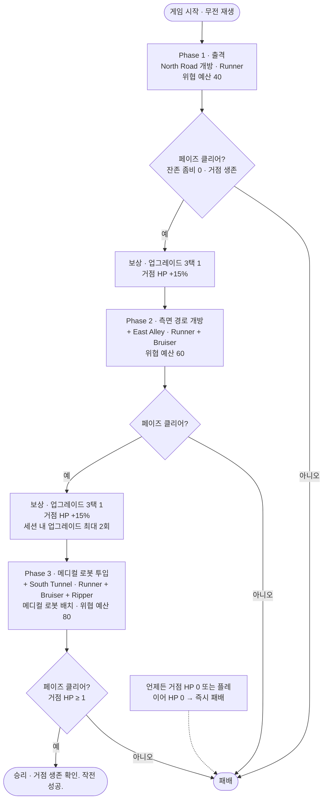
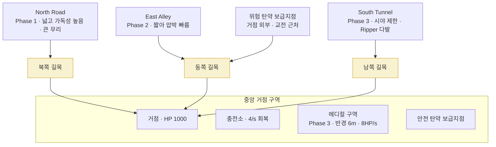

# 기능 명세서: 「텔레 로봇팀, 출격하라」 MVP 수직 슬라이스

**Feature Branch**: `001-robot-base-defense-mvp` (현재 이 브랜치에서 작업 중)

**Created**: 2026-06-27

**Status**: Draft

**Input**: 사용자 설명 — 단일 플레이어 3D 3인칭 좀비 거점 방어 슈터 「텔레 로봇팀, 출격하라」의 MVP 수직 슬라이스 기능 명세. 빠른 좀비가 점진적으로 개방되는 경로를 통해 중앙 거점을 공격하는 동안, 플레이어가 직접 사격하면서 강력하지만 배터리에 제약받는 로봇 아군을 지휘하는 10~15분 분량의 핵심 게임플레이 루프를 검증한다.

> **본 명세의 범위 규칙**: 본 문서는 **무엇을(WHAT)**, **왜(WHY)**만 기술한다. 게임 엔진, 프로그래밍 언어, 렌더링 파이프라인, 네트워킹 프레임워크, 에셋 스토어, 플랫폼 등 **구현 방법(HOW)**은 의도적으로 선택하거나 가정하지 않는다. 모든 수치(데미지, HP, 배터리 등)는 플레이어가 체감하는 게임 규칙이자 밸런스 목표값으로 취급한다.

---

## 개요 다이어그램 *(비규범적 — 시각화용)*

> 아래 다이어그램은 **읽기 편의를 위한 개요 시각화**이며 규범(normative)이 아니다. 값·규칙의 최종 근거는 아래 Requirements의 FR 문구이다. 충돌 시 FR이 우선한다.

### 세션 · 페이즈 진행 흐름 (Session & Phase Flow)

3개 페이즈가 업그레이드/거점 회복 관문을 사이에 두고 누적되며, 각 페이즈는 "전멸 + 거점 생존" 시 클리어된다. 거점 HP 0 또는 플레이어 HP 0는 **언제든** 즉시 패배다 (FR-004·FR-005·FR-061).

### 맵 개요 (Map Schematic)

3개 경로가 각 페이즈에 걸쳐 순차 개방되며 모두 중앙 거점으로 수렴한다. 각 경로의 **거점 진입 길목(choke)**은 「긴급 방벽」 업그레이드가 방벽을 생성하는 지점이다 (FR-025·FR-030~037).

---

## User Scenarios & Testing *(mandatory)*

> 사용자 스토리는 플레이어 여정 단위로 우선순위를 매긴다. 게임 MVP 특성상 후순위 스토리는 선순위 스토리 위에 누적되는 계층이지만, 각 스토리는 **자체 합격 기준으로 독립 검증**할 수 있도록 작성한다.

### User Story 1 - 거점 방어 핵심 전투 루프 (Phase 1 「출격」) (Priority: P1)

플레이어는 게임을 시작하면 "텔레 로봇팀, 출격하라." 무전을 듣고 중앙 거점을 지키는 야전 지휘관이 된다. 북쪽 도로(North Road)로 빠른 러너(Runner) 좀비가 몰려오고, 플레이어는 3인칭 시점에서 이동·조준하며 돌격소총으로 직접 사격한다. 두 대의 해태(Haetae) 전투 로봇이 자동으로 좀비를 탐지·추격·처치한다. 거점에 도달한 좀비는 거점 HP를 깎고, 거점이 파괴되거나 플레이어가 사망하면 패배한다. 1개 페이즈만으로도 "빠른 좀비 + 압도적으로 강한 해태 로봇 + 중앙 거점 방어"라는 핵심 환상을 체험할 수 있는 최소 단위 슬라이스다.

**Why this priority**: 이 스토리만 구현해도 플레이 가능한 최소 기능 게임(viable MVP)이 성립한다. 이동·사격·거점 방어·로봇 자동 전투·승패 판정이라는 토대 위에 이후 모든 스토리가 쌓인다.

**Independent Test**: North Road만 개방한 단일 페이즈를 실행해, 플레이어가 러너를 직접 사격해 처치하고, 해태 로봇이 자동으로 러너를 1~2초 내에 처치하며, 거점에 도달한 러너가 거점 HP를 깎고, 거점 HP 0 또는 플레이어 HP 0 시 패배하며, 모든 러너 처치 시 페이즈 클리어가 발생하는지로 독립 검증한다.

**Acceptance Scenarios**:

1. **Given** 게임이 막 시작된 상태, **When** 게임이 로드되면, **Then** "텔레 로봇팀, 출격하라." 무전이 재생되고 North Road가 유일하게 개방된 경로로 표시된다.
2. **Given** Phase 1이 진행 중, **When** 플레이어가 러너의 몸통을 사격하면, **Then** 약 3발에, 머리를 사격하면 1~2발에 러너가 처치된다.
3. **Given** 해태 로봇이 Engage 상태, **When** 러너와 근접 교전하면, **Then** 약 1~2초 내에 러너를 처치한다.
4. **Given** 러너가 거점에 도달, **When** 거점을 공격하면, **Then** 거점 HP가 8씩 감소한다.
5. **Given** 거점 HP가 0이 됨, **When** 거점이 파괴되면, **Then** 게임은 즉시 패배 상태로 전환된다.
6. **Given** 플레이어 HP가 0이 됨, **When** 플레이어가 사망하면, **Then** 게임은 즉시 패배 상태로 전환된다.
7. **Given** Phase 1의 모든 좀비가 스폰되어 전멸했고 거점이 생존, **When** 클리어 조건을 만족하면, **Then** Phase 1이 클리어된다.

---

### User Story 2 - 해태 로봇 지휘와 배터리 전략 (Priority: P1)

플레이어는 단순한 생존자가 아니라 로봇 부대의 지휘관이다. 해태 로봇에게 **거점 사수(Defend Position)·경로 순찰(Patrol Route)·기지 복귀(Return to Base)·충전(Charge)** 4가지 명령을 내릴 수 있다. 모든 행동은 배터리를 소모한다(대기 0.3/초, 순찰 0.8/초, 전투 2.5/초). 배터리가 낮아지면 로봇이 느려지고 약해지며, 0이 되면 기능을 멈춘다. 거점의 충전소에서 충전하면 회복(4/초)되지만 충전 중에는 싸울 수 없다. 충전 타이밍을 놓치면 강력한 로봇이 쓸모없어지고 거점이 위험해진다.

**Why this priority**: 배터리·충전·명령은 본 게임의 핵심 차별 요소다. 이 메커닉이 없으면 평범한 슈터에 불과하며, "해태는 강한데 충전 타이밍을 놓치면 거점이 위험해진다"는 검증 목표 자체가 성립하지 않는다.

**Independent Test**: 명령 메뉴로 각 명령을 내리고, 명령별 배터리 소모율 차이를 확인하고, 배터리 11~30% 구간에서 이동 -15%·공격속도 -10% 저하가 적용되고, 배터리 0에서 로봇이 정지하며, 충전소에서 4/초로 회복되는지로 독립 검증한다.

**Acceptance Scenarios**:

1. **Given** 해태 로봇이 선택된 상태, **When** 명령 메뉴를 열면, **Then** Defend Position·Patrol Route·Return to Base·Charge 4개 명령만 제공된다.
2. **Given** 로봇이 전투 중(Combat), **When** 1초가 경과하면, **Then** 배터리가 2.5 감소한다. (대기 0.3/초, 순찰 0.8/초)
3. **Given** 로봇 배터리가 11~30 구간(Low Power), **When** 로봇이 이동·공격하면, **Then** 이동속도가 15% 감소하고 공격속도가 10% 감소한다.
4. **Given** 로봇 배터리가 1~10 구간(Critical), **When** Critical에 진입하면, **Then** 명확한 경고가 발생한다.
5. **Given** 로봇 배터리가 0(Depleted), **When** Depleted가 되면, **Then** 로봇은 충전 또는 회복 전까지 이동·공격이 불가능한 Disabled 상태가 된다.
6. **Given** 로봇이 충전소에서 Charge 명령 수행 중, **When** 1초가 경과하면, **Then** 배터리가 4 회복되며 그 동안 로봇은 전투에 참여하지 않는다.
7. **Given** 플레이어가 어느 한쪽 경로 방어가 시급한 상황, **When** 로봇을 충전소로 보낼지 전투를 유지할지 결정하면, **Then** 충전(전력 회복)과 전투 공백 사이의 트레이드오프가 발생한다.
8. **Given** 로봇이 Depleted(배터리 0)로 Disabled됨, **When** 일정 시간(MVP 잠정 기본값 5초) 경과 후, **Then** 로봇은 Recovery 상태로 전환되어 배터리를 0.5/초(잠정)로 회복하고, 이동 가능 임계값(배터리 5, 잠정) 도달 시 자동으로 충전소로 복귀하며, Recovery·복귀 중에는 공격할 수 없다.

---

### User Story 3 - 측면 경로 개방과 페이즈 보상 (Phase 2 「측면 경로 개방」) (Priority: P2)

Phase 1 클리어 후 플레이어는 3개 중 1개의 업그레이드를 선택하고, 거점은 최대 HP의 15%를 회복한다. 이어서 동쪽 골목(East Alley)이 추가로 개방되어 두 경로 동시 압박이 시작된다. North Road는 넓고 잘 보이며 큰 무리가, East Alley는 짧아 거점 압박이 빠르다. 여기에 고HP 브루저(Bruiser)가 등장한다. 플레이어는 어느 경로를 직접 막고 어느 경로를 로봇에 맡길지, 그리고 배터리 관리를 본격적으로 고민해야 한다.

**Why this priority**: 두 경로 압박과 업그레이드 선택은 핵심 루프의 "압박 증가"와 "선택의 의미"를 검증한다. P1 토대 위에서 동작하지만, 다중 경로·페이즈 전환·보상이라는 독립된 검증 단위를 형성한다.

**Independent Test**: Phase 1 클리어 직후 3택 1 업그레이드 화면이 뜨고, 선택이 다음 페이즈에 반영되며, 거점 HP가 15% 회복되고, Phase 2에서 North Road와 East Alley 두 경로가 동시에 개방되고 브루저가 등장하며, 위협 예산 기반으로 좀비가 구성되는지로 독립 검증한다.

**Acceptance Scenarios**:

1. **Given** Phase 1이 클리어됨, **When** 페이즈 전환이 처리되면, **Then** 3개 업그레이드 후보가 제시되고 플레이어는 정확히 1개를 선택한다.
2. **Given** Phase 1 클리어 처리, **When** 거점이 생존한 상태로 정비 단계에 진입하면, **Then** 거점이 최대 HP의 15%(150)를 회복한다.
3. **Given** Phase 2가 시작됨, **When** 새 경로가 개방되면, **Then** East Alley가 강조 표시되고 "동쪽 골목에서 추가 접근 신호 감지." 무전이 재생되며 North Road와 함께 두 경로가 활성화된다.
4. **Given** Phase 2 진행 중, **When** 브루저가 거점을 공격하면, **Then** 거점 HP가 60 감소하여 무시할 수 없는 위협이 된다.
5. **Given** 해태 로봇 한 대를 한 경로에 고정 배치, **When** 시간이 지나면, **Then** 그 경로 방어는 유용하지만 배터리가 눈에 띄게 소모된다.

---

### User Story 4 - 종합 국면: 리퍼·메디컬 로봇 (Phase 3 「메디컬 로봇 투입」) (Priority: P3)

Phase 2 클리어 후 두 번째이자 마지막 업그레이드를 선택하면, 남쪽 터널(South Tunnel)이 개방되어 세 경로 동시 압박이 시작된다. "남쪽 터널 개방. 메디컬 로봇 투입." 무전과 함께 1대의 메디컬 로봇이 거점 근처에 배치되어 치료 구역을 형성한다. 시야가 나쁜 South Tunnel에서는 로봇 카운터인 리퍼(Ripper)가 더 자주 출현한다. 리퍼는 로봇을 우선 노리고 타격할 때마다 로봇 배터리를 추가로 5씩 고갈시킨다. 플레이어는 전방에서 싸우다 메디컬 구역으로 후퇴해 회복하고 복귀하며, 리퍼를 직접 처리해 해태 로봇을 보호해야 한다. Phase 3을 거점 생존 상태로 클리어하면 승리한다.

**Why this priority**: 모든 메커닉의 정점이자 승리 조건이 걸린 국면이다. 메디컬 로봇(전진-후퇴-복귀 리듬)과 리퍼(로봇 방치 처벌)가 핵심 차별 요소를 완성하므로 P3로 두되, 앞선 스토리 전체를 전제한다.

**Independent Test**: Phase 2 클리어 후 두 번째 업그레이드 선택이 발생하고, Phase 3에서 세 경로가 모두 개방되며, 메디컬 로봇이 6m 반경에서 초당 8 HP로 플레이어를 우선 치료하고, 리퍼가 시청각적으로 구별되며 로봇 타격 시 배터리를 5씩 추가 고갈시키고, 거점 생존 상태로 Phase 3 클리어 시 "거점 생존 확인. 작전 성공." 승리가 발생하는지로 독립 검증한다.

**Acceptance Scenarios**:

1. **Given** Phase 2가 클리어됨, **When** 페이즈 전환이 처리되면, **Then** 두 번째(세션 내 최대 2회째) 업그레이드 선택이 발생한다.
2. **Given** Phase 3가 시작됨, **When** South Tunnel이 개방되면, **Then** "남쪽 터널 개방. 메디컬 로봇 투입." 무전이 재생되고 세 경로(North Road·East Alley·South Tunnel)가 모두 활성화되며 메디컬 로봇이 배치된다.
3. **Given** 플레이어가 메디컬 로봇 6m 반경 내에 있고 HP가 최대치 미만, **When** 1초가 경과하면, **Then** 플레이어 HP가 8 회복된다.
4. **Given** 리퍼가 출현, **When** 화면/음향에 표시되면, **Then** 리퍼는 다른 좀비와 시각·청각적으로 구별되고 특수 적 아이콘과 음성 콜아웃이 발생한다.
5. **Given** 리퍼가 해태 로봇을 타격, **When** 명중하면, **Then** 일반 데미지에 더해 로봇 배터리가 추가로 5 감소한다.
6. **Given** 플레이어가 리퍼를 방치, **When** 리퍼가 로봇을 지속 공격하면, **Then** 해태 로봇이 무력화되거나 Disabled 상태에 빠진다.
7. **Given** Phase 3의 모든 좀비가 전멸하고 거점 HP가 1 이상, **When** 클리어 조건을 만족하면, **Then** 플레이어가 승리한다.

---

### User Story 5 - 전황 인지: HUD·경보·무전 (Priority: P2)

플레이어는 화면 밖 위협과 자원 상태를 즉시 파악할 수 있어야 한다. HUD는 거점 HP, 페이즈 진행도, 경로 경보/미니맵, 로봇 배터리, 플레이어 HP, 탄약, 로봇 명령 퀵메뉴를 표시한다. 정보 우선순위는 거점 HP > 로봇 배터리 > 경로 경보 순이다. 임계값(배터리 25%/10%, 거점 HP 30%)에서 시각 경고와 음성 콜아웃이 트리거되어, 전투 중에도 과부하 없이 핵심 위협을 전달한다.

**Why this priority**: 정보 전달 계층은 다른 스토리의 의사결정을 가능하게 만드는 지원 시스템이다. 핵심 루프 검증에 필수이나 전투 메커닉 위에서 동작하므로 P2로 둔다.

**Independent Test**: 각 임계 조건(새 경로 개방, 배터리 25%·10%, 거점 HP 30%, 리퍼 출현)을 인위적으로 유발해 해당 시각 경고·음성 콜아웃이 정확히 트리거되고, HUD 7개 요소가 모두 표시되며, 전투 중 화면이 과도하게 가려지지 않는지로 독립 검증한다.

**Acceptance Scenarios**:

1. **Given** 게임 진행 중, **When** HUD를 확인하면, **Then** 거점 HP·페이즈 진행도·경로 경보/미니맵·로봇 배터리·플레이어 HP·탄약·로봇 명령 퀵메뉴가 모두 표시된다.
2. **Given** 로봇 배터리가 25% 미만, **When** 임계값을 넘으면, **Then** 노란색 점멸 경고와 음성 콜아웃("해태 1호, 배터리 위험.")이 발생한다.
3. **Given** 로봇 배터리가 10% 미만, **When** 임계값을 넘으면, **Then** 빨간색 점멸 경고와 긴급 음성 콜아웃이 발생한다.
4. **Given** 거점 HP가 30% 이하, **When** 임계값을 넘으면, **Then** 화면 가장자리 경고와 경보음("거점 방어선 붕괴 임박.")이 발생한다.
5. **Given** 새 경로가 개방됨, **When** 개방 이벤트가 발생하면, **Then** 경로 강조 표시와 무전 경고가 발생한다.

---

### Edge Cases

- **두 경로 동시 압박 중 배터리 동시 고갈**: 두 해태 로봇이 동시에 Depleted 상태가 되어 모든 경로가 무방비가 되면 어떻게 되는가? (플레이어 단독 방어로 전환되며, 거점 위험 경보가 우선 노출되어야 한다.)
- **Disabled 로봇의 복귀 경로**: 배터리 0인 로봇은 이동할 수 없는데 어떻게 충전소로 복귀하는가? (Assumptions 참조 — 자동 미세 회복(Recovery) 후 이동 가능 임계값 도달 시 복귀.)
- **해태 로봇 HP 파괴**: 좀비 피해로 해태 로봇 HP가 0이 되면? (FR-081 — 현재 페이즈 동안 Destroyed(잔해)로 전투 불가, 다음 페이즈 시작 시 복원. 배터리 소진과는 별개 처리.) 한 페이즈에서 두 대 모두 Destroyed되면 해당 페이즈 잔여 구간은 플레이어 단독 방어로 전환된다.
- **충전 중 거점 피격**: 로봇이 충전소에서 충전 중일 때 좀비가 거점/충전소에 도달하면? (충전 중 로봇은 전투에 참여하지 않으므로 플레이어가 직접 방어해야 한다.)
- **메디컬 로봇 파괴**: 좀비가 메디컬 로봇에 도달해 파괴하면? (치료 구역이 소멸하며, MVP에서는 재생성되지 않는다 — Assumptions 참조.)
- **탄약 고갈**: 탄창이 비고 예비 탄약 보급 시점을 놓치면? (위험 보급지점으로 이동하거나 근접 위협을 감수해야 한다.)
- **재장전 중 피격**: 2초 재장전 도중 근접 좀비에게 노출되면 플레이어가 큰 피해를 입을 수 있다.
- **위협 예산과 목표 마릿수 불일치**: 위협 예산(Phase 1=40)과 목표 마릿수(러너 20~30) 사이의 구성 규칙. (Assumptions 참조 — 예산은 상한, 페이즈 학습 목표에 맞는 구성을 우선한다.)
- **리퍼가 거점/플레이어로 표적 전환**: 주변에 로봇이 없을 때 리퍼의 표적 우선순위(로봇 → 플레이어 → 거점)에 따른 행동.
- **업그레이드와 진행 중 상태 충돌**: "거점 장갑 보강(최대 HP +200)" 선택 시 현재 HP/비율 처리, "확장 탄창" 선택 시 현재 장전 탄약 처리.

---

## Clarifications

### Session 2026-07-03

- Q: 해태 로봇의 HP(300)가 0이 되면(배터리 고갈이 아니라 좀비 피해로 파괴) 어떻게 처리되어야 하는가? → A: 해당 페이즈 동안 잔해(전투 불가)로 파괴되어 남고, 다음 페이즈 시작 시 최대 HP로 복원된다(수류탄·거점 15% 회복과 동일한 페이즈 경계 리듬).
- Q: 페이즈 위협 예산 구성이 시간에 걸쳐 어떻게 스폰되어야 하는가(즉시 전량 vs 웨이브 vs 연속)? → A: 개방된 경로에서 일정 간격으로 연속 스폰하되, 필드 동시 생존 좀비 수를 상한(concurrent cap)으로 제한한다. 스폰 간격·동시 상한은 결정적 시뮬레이션이 재현할 수 있는 데이터 구동 파라미터이며 밸런싱 대상 잠정값이다.
- Q: 로봇 명령(4가지)의 대상 지정 방식은(개별 vs 전체)? → A: 두 해태 로봇을 개별 선택해 명령하거나, '전체 선택' 토글로 두 대에 동시 명령할 수 있다(개별 지휘와 일괄 지휘를 모두 지원). 명령은 로봇 단위로 적용된다.

## Requirements *(mandatory)*

### Functional Requirements

#### 게임 흐름 · 승패 (Game Flow & Win/Lose)

- **FR-001**: 시스템은 게임 시작 시 "텔레 로봇팀, 출격하라." 무전을 재생하고 페이즈 준비 단계를 시작해야 한다(MUST).
- **FR-002**: 시스템은 단일 플레이어 PvE 세션으로만 동작해야 하며(MUST), 멀티플레이어 요소를 포함하지 않아야 한다(MUST NOT).
- **FR-003**: 시스템은 Phase 1 → Phase 2 → Phase 3의 3개 페이즈로 구성된 수직 슬라이스를 제공해야 한다(MUST).
- **FR-004**: 시스템은 Phase 3를 거점 HP 1 이상인 상태로 클리어하면 승리로 판정해야 한다(MUST).
- **FR-005**: 시스템은 거점 HP가 0이 되거나 플레이어가 사망하면 즉시 패배 상태로 전환해야 한다(MUST).
- **FR-006**: 시스템은 1회 전체 세션이 목표 10~15분 내에 완료되도록 콘텐츠 분량을 구성해야 한다(SHOULD).

#### 플레이어 · 무기 (Player & Weapon)

- **FR-010**: 시스템은 3인칭 시점의 플레이어 이동과 조준을 제공해야 한다(MUST).
- **FR-011**: 플레이어는 기본 돌격소총으로 직접 사격할 수 있어야 한다(MUST).
- **FR-012**: 돌격소총의 기본 데미지는 30이어야 한다(MUST).
- **FR-013**: 헤드샷 데미지 배율은 2.5배여야 한다(MUST).
- **FR-014**: 탄창 크기는 30발이어야 한다(MUST).
- **FR-015**: 재장전 시간은 2초여야 한다(MUST).
- **FR-016**: 시스템은 탄약·탄창·재장전 동작(잔탄 추적, 탄창 소진, 재장전)을 제공해야 한다(MUST).
- **FR-017**: 플레이어는 100 HP를 가지며, HP가 0이 되면 사망(패배)해야 한다(MUST).
- **FR-018**: 플레이어는 각 페이즈를 2개의 수류탄으로 시작해야 한다(MUST).
- **FR-019**: 플레이어 역할은 리퍼 처치, 빈 경로 커버, 비상시 거점 방어, 로봇 배터리·경로 배치 의사결정을 포함해야 한다(MUST). 즉 게임은 이 행동들이 유의미해지도록 설계되어야 한다.

#### 거점 (Base)

- **FR-020**: 거점은 1000 HP를 가져야 한다(MUST).
- **FR-021**: 거점은 각 페이즈 클리어 종료 시 최대 HP의 15%를 회복해야 한다(MUST).
- **FR-022**: 시스템은 MVP 범위에서 플레이어 조작에 의한 거점 수리를 제공하지 않아야 한다(MUST NOT).
- **FR-023**: 거점 HP가 최대치의 30% 이하가 되면 시각·청각 경고를 트리거해야 한다(MUST).
- **FR-024**: 거점 HP가 0이 되면 게임은 즉시 패배 상태로 진입해야 한다(MUST).
- **FR-025**: 모든 좀비 경로는 중앙 거점을 향하도록 구성되어야 한다(MUST).

#### 경로 · 맵 (Routes & Map)

- **FR-030**: 맵은 모든 경로가 수렴하는 중앙 거점을 포함해야 한다(MUST).
- **FR-031**: 시스템은 North Road(Phase 1 개방), East Alley(Phase 2 개방), South Tunnel(Phase 3 개방)의 3개 경로를 제공해야 한다(MUST).
- **FR-032**: North Road는 넓고 가독성이 높아야 하며(MUST), 더 큰 좀비 무리를 포함해야 한다(SHOULD).
- **FR-033**: East Alley는 더 짧아 빠른 거점 압박을 만들어야 한다(MUST).
- **FR-034**: South Tunnel은 시야가 제한적이어야 하며(MUST), 리퍼 압박을 지원해야 한다(MUST). 즉 리퍼는 South Tunnel에서 더 자주 출현해야 한다(MUST).
- **FR-035**: 거점 내부 또는 인접 위치에 충전소가 존재해야 한다(MUST).
- **FR-036**: 메디컬 로봇 투입 이후, 거점 근처에 메디컬(치료) 구역이 존재해야 한다(MUST).
- **FR-037**: 탄약 보급은 두 곳에 존재해야 한다 — 거점 내부의 안전 보급지점 1곳과, 거점 외부 또는 교전 지역 근처의 위험 보급지점 1곳(MUST).
- **FR-038**: 플레이어는 미니맵에만 의존하지 않고 경로를 직접 확인하도록 유도되어야 한다(SHOULD) — 특히 시야가 나쁜 South Tunnel.

#### 좀비 (Zombies)

- **FR-040**: 시스템은 러너(Runner)·브루저(Bruiser)·리퍼(Ripper) 3종의 좀비만 제공해야 하며(MUST), 그 외 좀비 종류를 추가하지 않아야 한다(MUST NOT).
- **FR-041**: 좀비는 더 높은 우선순위 표적이 탐지되지 않는 한, 배정된 경로를 따라 거점으로 이동해야 한다(MUST).
- **FR-042 (Runner)**: 러너는 HP 90, 빠른 이동 속도, 거점 데미지 8, 플레이어 데미지 12, 낮은 로봇 데미지를 가져야 한다(MUST). 몸통 약 3발, 머리 1~2발에 처치되어야 한다(SHOULD). 표적 우선순위는 1) 거점 2) 플레이어 3) 로봇이어야 한다(MUST).
- **FR-043 (Bruiser)**: 브루저는 HP 500, 느린 이동 속도, 거점 데미지 60, 플레이어 데미지 30, 중간 로봇 데미지를 가져야 한다(MUST). 몸통 약 15~20발, 머리 6~8발에 처치되어야 한다(SHOULD). 표적 우선순위는 1) 거점 2) 로봇 3) 플레이어여야 한다(MUST).
- **FR-044 (Ripper)**: 리퍼는 HP 180, 빠른 이동 속도, 거점 데미지 10, 플레이어 데미지 18, 중간 로봇 데미지를 가져야 한다(MUST). 몸통 약 6발, 머리 2~3발에 처치되어야 한다(SHOULD). 표적 우선순위는 1) 로봇 2) 플레이어 3) 거점이어야 한다(MUST).
- **FR-045 (Ripper 특수효과)**: 리퍼가 로봇을 타격할 때마다 해당 로봇의 배터리를 추가로 5 고갈시켜야 한다(MUST).
- **FR-046**: 리퍼는 Phase 3에서 처음 출현해야 한다(MUST).
- **FR-047**: 리퍼는 다른 좀비와 시각·청각적으로 구별되어야 한다(MUST). 설계 목적은 플레이어가 로봇을 방치하지 못하게 하는 것이다.

#### 스폰 · 위협 예산 (Spawning & Threat Budget)

- **FR-050**: 좀비 스폰은 고정 마릿수가 아닌 페이즈 위협 예산(threat budget)으로 제어되어야 한다(MUST).
- **FR-051**: MVP 위협 예산은 Phase 1 = 40, Phase 2 = 60, Phase 3 = 80이어야 한다(MUST).
- **FR-052**: 위협 비용은 러너 1, 브루저 5, 리퍼 4여야 한다(MUST).
- **FR-053**: 각 페이즈는 학습 목표에 적합한 좀비 구성을 스폰해야 한다(MUST). 권장 구성: Phase 1은 러너 20~30; Phase 2는 총 35~50마리(브루저 2~3 포함); Phase 3는 총 55~75마리(리퍼 3~5 포함).
- **FR-054**: 시스템은 페이즈 시작 시 스폰을 시작하고, 페이즈 위협 예산 상한 내에서 조정된 목표 구성을 모두 스폰하면 스폰을 중지해야 한다(MUST). (예산 상한과 권장 마릿수가 충돌할 때의 조정 규칙은 Assumptions "위협 예산 vs 목표 마릿수" 참조.)
- **FR-055**: 조정된 목표 구성은 즉시 전량이 아니라 개방된 경로에서 일정 간격으로 **연속 스폰**되어야 하며(MUST), 시스템은 필드에 동시 생존하는 좀비 수를 **동시 생존 상한(concurrent cap)**으로 제한해야 한다(MUST) — 상한에 도달하면 좀비가 처치·소멸되어 여유가 생길 때까지 다음 스폰을 지연한다. 스폰 간격과 동시 생존 상한은 데이터 구동 파라미터여야 하며(MUST), 결정적 시뮬레이션이 동일 시드·동일 데이터에서 재현 가능해야 한다(MUST). (구체 수치는 밸런싱 대상 잠정값.)

#### 페이즈 시스템 (Phase System)

- **FR-060**: 시스템은 현재 페이즈, 개방된 경로 목록, 페이즈 위협 예산을 추적해야 한다(MUST).
- **FR-061**: 시스템은 다음 페이즈 전환 규칙을 순서대로 처리해야 한다(MUST): ① 현재 페이즈의 모든 좀비 스폰 완료 → ② 필드의 잔존 좀비 전멸 → ③ 거점 생존 확인 → ④ 페이즈 클리어 처리 → ⑤ (해당 시) 업그레이드 선택 → ⑥ 다음 경로 개방 → ⑦ 다음 페이즈 시작.
- **FR-062**: 시스템은 적절한 페이즈에서 새 경로를 개방하고 새 로봇 능력/유닛(Phase 3 메디컬 로봇)을 투입해야 한다(MUST).
- **FR-063**: 시스템은 페이즈 클리어를 감지하고 보상·업그레이드 선택을 트리거해야 한다(MUST).
- **FR-064**: 각 페이즈 난이도와 목표 지속 시간은 다음을 지향해야 한다(SHOULD): Phase 1 낮음/2~3분, Phase 2 중간/3~4분, Phase 3 높음/4~5분.

#### 해태 전투 로봇 (Haetae Combat Robots)

- **FR-070**: 시스템은 Phase 1부터 2대의 해태 전투 로봇을 제공해야 한다(MUST).
- **FR-071**: 각 해태 로봇은 300 HP를 가져야 한다(MUST).
- **FR-072**: 각 해태 로봇은 최대 배터리 100을 가져야 한다(MUST).
- **FR-073**: 해태 로봇은 빠르게 이동해야 한다(MUST).
- **FR-074**: 해태 로봇은 근접 돌진·물기 공격을 사용해야 한다(MUST).
- **FR-075**: 해태 로봇은 러너를 약 1~2초 내에 처치할 수 있어야 한다(MUST).
- **FR-076**: 해태 로봇은 브루저를 처치하는 데 약 6~10초가 걸려야 한다(SHOULD).
- **FR-077**: 해태 로봇은 일반 좀비에게는 압도적으로 강하되, 배터리 압박과 리퍼에는 취약해야 한다(MUST).
- **FR-078**: 시스템은 좀비를 탐지·추격·공격하는 로봇 AI를 제공해야 한다(MUST).
- **FR-079**: 해태 로봇은 다음 상태를 지원해야 한다(MUST): Standby, Patrol, Engage, Low Battery, Return to Charge, Charging, Disabled, Recovery, Destroyed.
- **FR-080**: 배터리가 0인 해태 로봇은 충전 또는 회복으로 가용 상태가 되기 전까지 이동·공격할 수 없어야 한다(MUST).
- **FR-081**: 해태 로봇 HP가 0이 되면(좀비 피해에 의한 파괴) 해당 로봇은 현재 페이즈 동안 Destroyed(잔해) 상태로 전환되어 이동·공격·명령 수행이 불가능해야 하며(MUST), 다음 페이즈 시작 시 최대 HP(300)와 사용 가능한 배터리로 복원되어야 한다(MUST). 이는 배터리 Depleted→Recovery 경로(FR-080·Assumptions)와 구별되는 별도 처리다. (Destroyed는 HP 소진, Depleted/Disabled는 배터리 소진에 의한 상태다.)

#### 로봇 명령 (Robot Commands)

- **FR-085**: 로봇 명령 메뉴는 다음 4개 명령만 제공해야 한다(MUST): 거점 사수(Defend Position), 경로 순찰(Patrol Route), 기지 복귀(Return to Base), 충전(Charge). 그 외 명령을 포함하지 않아야 한다(MUST NOT).
- **FR-086**: 플레이어는 명령을 통해 어느 경로를 직접 방어하고 어느 경로를 로봇에 맡길지 결정할 수 있어야 한다(MUST).
- **FR-087**: 플레이어는 두 해태 로봇을 **개별 선택**해 각각에 명령을 발행할 수 있어야 하며(MUST), **전체 선택 토글**로 두 대에 동일 명령을 동시 발행할 수 있어야 한다(MUST). 명령은 항상 로봇 단위로 적용되어, 두 로봇이 서로 다른 경로/명령을 수행할 수 있어야 한다(MUST).

#### 로봇 배터리 (Robot Battery)

- **FR-090**: 최대 배터리는 100이어야 한다(MUST).
- **FR-091**: 배터리 상태 구간은 다음과 같아야 한다(MUST): Normal 31~100, Low Power 11~30, Critical 1~10, Depleted 0, Charging(충전소에서 충전 중).
- **FR-092**: 배터리 소모율은 대기 0.3/초, 순찰 0.8/초, 전투 2.5/초여야 한다(MUST).
- **FR-093**: 리퍼 타격은 추가 배터리 손실 5를 유발해야 한다(MUST).
- **FR-094**: 충전은 배터리를 4/초 회복시켜야 한다(MUST).
- **FR-095**: Low Power 효과로 이동속도 15% 감소, 공격속도 10% 감소가 적용되어야 한다(MUST).
- **FR-096**: Critical 배터리는 명확한 경고를 트리거해야 한다(MUST).
- **FR-097**: 충전 중인 로봇은 전투에 참여할 수 없어야 한다(MUST).
- **FR-098**: 배터리 시스템은 단순한 성가심이 아니라 전략적 의사결정을 유발해야 한다(MUST) — 충전 타이밍이 거점 안위와 직결되어야 한다.

#### 메디컬 로봇 (Medical Robot)

- **FR-100**: 메디컬 로봇은 Phase 3에서 투입되어야 한다(MUST).
- **FR-101**: 메디컬 로봇은 150 HP를 가져야 한다(MUST).
- **FR-102**: 메디컬 로봇은 거점 근처에 머물러야 한다(MUST).
- **FR-103**: 메디컬 로봇은 MVP에서 공격하지 않는 비전투 지원 유닛이어야 한다(MUST). (원안의 "매우 약한 공격" 옵션은 MVP 범위에서 보류 — Assumptions "메디컬 로봇 공격성" 참조.)
- **FR-104**: 메디컬 로봇은 플레이어를 최우선으로 치료해야 한다(MUST).
- **FR-105**: 치료량은 초당 8 HP여야 한다(MUST).
- **FR-106**: 치료 반경은 6미터여야 한다(MUST).
- **FR-107**: 메디컬 로봇은 좀비가 도달하면 피해를 입거나 파괴될 수 있어야 한다(MUST).
- **FR-108**: 메디컬 로봇은 플레이어가 전방에서 싸우다 후퇴해 회복하고 복귀하는 리듬을 가능하게 해야 한다(MUST).

#### 업그레이드 시스템 (Upgrade System)

- **FR-110**: 시스템은 각 적격 페이즈(Phase 1·Phase 2) 종료 후 3개 제시안 중 1개를 플레이어가 선택하게 해야 한다(MUST).
- **FR-111**: MVP는 총 9개의 업그레이드 후보를 포함해야 한다(MUST).
- **FR-112**: 1회 전체 세션에서 업그레이드 선택은 최대 2회여야 한다(MUST).
- **FR-113**: 업그레이드 후보는 다음 9종이어야 한다(MUST):
  1. **고효율 배터리**: 모든 로봇 최대 배터리 +20
  2. **전투 절전 모드**: 로봇 전투 배터리 소모 -20%
  3. **해태 돌진 강화**: 해태 첫 돌진 데미지 +40%
  4. **충전소 고속화**: 충전 속도 +30%
  5. **거점 장갑 보강**: 거점 최대 HP +200
  6. **긴급 방벽**: 페이즈 시작 시 각 경로에 1회용 방벽 생성
  7. **관통탄**: 탄환이 러너 1마리를 추가 관통
  8. **확장 탄창**: 탄창 크기 +15
  9. **응급 회복 프로토콜**: 메디컬 로봇 치료량 +30%
- **FR-114**: 업그레이드 선택지는 수치 개선형과 플레이스타일 변화형을 모두 포함해야 한다(MUST).
- **FR-115**: 선택한 업그레이드는 즉시 적용되며, 그 효과는 해당 업그레이드가 영향을 주는 유닛/시스템이 존재하는 가장 가까운 페이즈에서 체감되어야 한다(MUST). 대부분의 업그레이드는 바로 다음 페이즈에서 체감된다. 예외: "응급 회복 프로토콜"(메디컬 로봇 치료량 +30%)을 Phase 1 종료 후 선택하면 효과는 선택 즉시 예약·적용되되 메디컬 로봇이 투입되는 Phase 3에서 체감된다. 9개 후보는 모든 보상 단계에서 동일하게 제공된다(특정 페이즈 보상풀에서 후보를 제거하지 않는다).

#### HUD · 경보 (HUD & Warnings)

- **FR-120**: HUD는 거점 HP, 페이즈 진행도, 경로 경보/미니맵, 로봇 배터리, 플레이어 HP, 탄약, 로봇 명령 퀵메뉴를 표시해야 한다(MUST).
- **FR-120a**: HUD 표시 요소 중 최소 전투 묶음(거점 HP·플레이어 HP·탄약·해태 배터리·로봇 명령 퀵메뉴)은 P1 스토리(US1·US2)와 함께 제공되어 P1의 독립 검증을 가능하게 해야 한다(MUST). 고도화된 전황 인지 묶음(미니맵/경로 경보·새 경로 강조·음성 콜아웃·리퍼 특수 아이콘)은 US5(P2) 범위에 속한다.
- **FR-121**: 전투 정보 우선순위는 1) 거점 HP 2) 로봇 배터리 3) 경로 경보여야 한다(MUST).
- **FR-122**: 새 경로 개방 시 경로 강조 표시와 무전 경고를 발생시켜야 한다(MUST).
- **FR-123**: 로봇 배터리 25% 미만 시 노란색 점멸 경고와 음성 콜아웃을 발생시켜야 한다(MUST).
- **FR-124**: 로봇 배터리 10% 미만 시 빨간색 점멸 경고와 긴급 음성 콜아웃을 발생시켜야 한다(MUST).
- **FR-125**: 거점 HP 30% 이하 시 화면 가장자리 경고와 경보음을 발생시켜야 한다(MUST).
- **FR-126**: 리퍼 출현 시 특수 적 아이콘과 음성 콜아웃을 발생시켜야 한다(MUST).
- **FR-127**: UI는 전투 중 플레이어에게 정보 과부하를 주지 않아야 한다(MUST).

#### 사운드 · 무전 (Sound & Radio)

- **FR-130**: 시스템은 다음 무전·사운드 이벤트를 제공해야 한다(MUST):
  - 게임 시작: "텔레 로봇팀, 출격하라."
  - Phase 1: "감염체 접근. 북쪽 도로 방어 준비."
  - Phase 2: "동쪽 골목에서 추가 접근 신호 감지."
  - Phase 3: "남쪽 터널 개방. 메디컬 로봇 투입."
  - 배터리 경고: "해태 1호, 배터리 위험."
  - 거점 위험: "거점 방어선 붕괴 임박."
  - 페이즈 클리어: "위협 제거. 재정비 단계 진입."
  - 승리: "거점 생존 확인. 작전 성공."
- **FR-131**: 사운드는 플레이어가 화면 밖 위협을 이해하도록 도와야 한다(MUST).

#### MVP 범위 제외 (Out of Scope for MVP)

- **FR-140**: 시스템은 다음을 포함하지 않아야 한다(MUST NOT): 멀티플레이어, 보스전, 대규모 오픈월드, 복잡한 스토리 캠페인, 다중 맵, 복잡한 로봇 커스터마이징, 제작/파밍 시스템, 다양한 무기, 엔드리스 모드, 해태/메디컬 외 추가 로봇, 러너/브루저/리퍼 외 추가 좀비.

### Key Entities

- **플레이어(Player)**: 야전 지휘관. 속성 — HP 100, 보유 무기(돌격소총), 수류탄 보유량, 위치. 사망 시 패배.
- **돌격소총·탄약(Assault Rifle / Ammo)**: 기본 데미지 30, 헤드샷 2.5배, 탄창 30, 재장전 2초, 잔탄/예비탄.
- **거점(Base)**: 방어 목표. 최대 HP 1000, 현재 HP, 페이즈 종료 시 15% 회복, 30% 이하 경고, 0 시 패배.
- **해태 전투 로봇(Haetae Combat Robot)** ×2: HP 300, 최대 배터리 100, 근접 돌진/물기, 상태(Standby/Patrol/Engage/Low Battery/Return to Charge/Charging/Disabled/Recovery/Destroyed), 현재 명령. HP 0 시 현재 페이즈 동안 Destroyed(잔해), 다음 페이즈 시작 시 복원(FR-081).
- **로봇 배터리(Robot Battery)**: 0~100, 상태 구간(Normal/Low Power/Critical/Depleted/Charging), 소모율(대기/순찰/전투), 충전율 4/초, 리퍼 추가 고갈 5.
- **메디컬 로봇(Medical Robot)** ×1 (Phase 3): HP 150, 치료 8 HP/초, 반경 6m, 플레이어 우선 치료, 파괴 가능, 거점 근처 고정.
- **좀비(Zombie)**: 공통 — 배정 경로, 표적 우선순위, 거점/플레이어/로봇 데미지. 하위 유형 — 러너(HP 90, 빠름), 브루저(HP 500, 느림), 리퍼(HP 180, 빠름, 로봇 배터리 추가 고갈, 로봇 카운터).
- **경로(Route)**: North Road(Phase 1), East Alley(Phase 2), South Tunnel(Phase 3). 속성 — 개방 여부, 가독성/길이/시야 특성, 좀비 흐름.
- **페이즈(Phase)**: 번호(1~3), 개방 경로, 위협 예산(40/60/80), 좀비 구성, 스폰 간격·동시 생존 상한(concurrent cap, 데이터 구동 잠정값), 클리어 상태, 목표 지속 시간.
- **위협 예산(Threat Budget)**: 페이즈 스폰 한도. 비용 — 러너 1, 브루저 5, 리퍼 4. 구성은 연속 스폰되며 동시 생존 상한으로 제어(FR-055).
- **업그레이드(Upgrade)**: 9개 후보, 페이즈당 3택 1, 세션당 최대 2회 선택, 수치형/플레이스타일형.
- **충전소(Charging Station)**: 거점 내부/인접. 로봇 배터리 4/초 회복, 충전 중 전투 불가.
- **메디컬 구역(Medical Zone)**: 메디컬 로봇 중심 반경 6m 치료 구역.
- **탄약 보급지점(Ammo Supply Point)** ×2: 안전(거점 내부) 1, 위험(외부/교전 근처) 1.
- **HUD/경보(HUD/Warning)**: 거점 HP·페이즈 진행도·경로 경보·로봇 배터리·플레이어 HP·탄약·명령 퀵메뉴, 임계값 경고.

---

## Success Criteria *(mandatory)*

### Measurable Outcomes

#### 세션 · 난이도 곡선 (Session & Difficulty Curve)

- **SC-001**: 1회 전체 MVP 세션(Phase 1~3)을 10~15분 내에 완료할 수 있다.
- **SC-002**: 플레이테스트에서 Phase 1 클리어율이 90% 이상이다.
- **SC-003**: 플레이테스트에서 Phase 2 클리어율이 60~75%이다.
- **SC-004**: 플레이테스트에서 Phase 3 클리어율이 35~55%이다.
- **SC-005**: 페이즈가 진행될수록 압박이 증가했다고 플레이테스터의 다수가 응답한다(경로 1→2→3, 좀비 다양성·마릿수 증가가 체감됨).

#### 핵심 차별 요소 검증 (Core Differentiator Validation)

- **SC-010**: 평균적으로 1회 플레이당 최소 1회 이상 해태 배터리 고갈(Depleted)이 발생한다.
- **SC-011**: 평균적으로 1회 플레이당 최소 2회 이상 플레이어가 로봇 충전(Charge) 명령을 내린다.
- **SC-012**: 패배 사유로서 거점 파괴가 플레이어 사망보다 더 흔하게 발생한다.
- **SC-013**: 플레이테스터의 다수가 해태 로봇이 강력하게 느껴졌다고 응답한다.
- **SC-014**: 플레이테스터의 다수가 좀비가 빠르지만 불공정하지 않았다고 응답한다.
- **SC-015**: 플레이테스터의 다수가 로봇 배터리에 신경을 썼다고 응답한다.
- **SC-016**: 플레이테스터의 다수가 메디컬 로봇이 플레이 방식을 바꿨다고 응답한다(전진-후퇴-복귀 리듬 형성).
- **SC-017**: 플레이테스터의 다수가 업그레이드 선택이 다음 페이즈에 의미 있게 영향을 줬다고 응답한다.

#### 페이즈별 학습 목표 (Per-Phase Learning Goals)

- **SC-020**: 플레이어는 Phase 1에서 주된 위협 방향(North Road)을 신속히 파악하고, 러너가 빠르지만 불공정하지 않다고 느끼며, 복잡한 로봇 마이크로컨트롤 없이 클리어할 수 있다.
- **SC-021**: 플레이어는 Phase 2에서 두 경로 중 한쪽도 무시할 수 없음을 인지하고, 로봇을 한 경로에 두는 유용함과 배터리 소모의 트레이드오프를 최소 1회 이상 체감한다.
- **SC-022**: 플레이어는 Phase 3에서 메디컬 구역으로 후퇴해 회복하고, 리퍼를 방치하면 해태 로봇이 무력화/Disabled되는 긴박함을 경험하며, 모든 이전 메커닉의 정점으로 느낀다.

#### 종합 검증 (Holistic Validation)

- **SC-030**: 플레이테스터가 경험을 "해태 로봇은 진짜 강한데, 충전 타이밍을 놓치면 거점이 바로 위험해진다."로 요약할 수 있으면 MVP는 성공으로 간주한다.
- **SC-031**: 기본 합격 테스트 — 한 플레이어가 10~15분 세션에서 Phase 1(빠른 좀비+강한 해태 학습), Phase 2(두 경로 압박+배터리 결정), Phase 3(세 경로+리퍼+메디컬 로봇)을 거쳐 거점 생존으로 승리하거나 거점 파괴/플레이어 사망으로 패배하는 완결된 경험을 한다.

---

## Assumptions

- **Disabled 로봇 회복(Recovery) 메커니즘**: 입력은 "충전 또는 회복으로 가용 상태가 되기 전까지 이동·공격 불가"라고만 명시한다. 0 배터리 로봇이 스스로 충전소로 갈 수 없는 모순을 해소하기 위해, Depleted 로봇은 Disabled 상태로 제자리에 정지한 뒤 **느린 미세 자동 회복(Recovery)**으로 소량의 배터리를 시간에 따라 회복하고, 이동 가능 최소 임계값에 도달하면 자동으로 충전소로 복귀(또는 플레이어 재명령 가능)한다고 가정한다. **MVP 잠정 기본값**: Depleted 진입 후 5초간 Disabled 유지 → 이후 Recovery 상태에서 0.5/초 회복 → 배터리 5 도달 시 이동 가능해지고 자동 Return to Charge 수행 → Recovery·복귀 중에는 공격 불가. (수치는 밸런싱 대상 잠정값이며, US2 합격 시나리오 8은 이 값으로 검증한다.)
- **배터리 상태 구간 vs 경보 임계값**: 상태 구간(FR-091: Low Power 11~30, Critical 1~10)은 로봇의 기계적 효과(이동·공격 저하)를 결정하고, 경보 임계값(FR-123 <25%, FR-124 <10%)은 별도의 UI 경고 계층이라고 가정한다. 두 체계는 의도적으로 분리되며 — 배터리 25~30 구간은 성능 저하는 있으나 황색 경보는 아직 없고, 배터리 10은 Critical 상태이되 적색 긴급 경보는 <10에서 발동하며 그 전까지 황색 경보가 유지된다. (입력의 상태 구간·경보 임계값 수치는 그대로 보존하고 경계 의미만 명확화한다.)
- **로봇 개별 지휘**: 두 해태 로봇은 개별 선택 가능하며, 명령은 로봇 단위로 적용된다(FR-087). 명령 퀵메뉴는 개별 선택된 로봇 또는 '전체 선택' 토글로 지정한 두 로봇 모두에 4개 명령을 발행한다.
- **경로 순찰 대상 지정**: Patrol Route 명령 시 플레이어가 순찰할 경로를 지정한다고 가정한다(개방된 경로 중 선택). Defend Position은 지정한 지점/경로를 사수한다.
- **위협 예산 vs 목표 마릿수**: 위협 예산(40/60/80)을 **하드 스폰 상한**으로 보고, 그 한도 내에서 각 페이즈 학습 목표에 맞는 구성(특수적 최소 수량 — Phase 2 브루저 2, Phase 3 리퍼 3 — 과 적 종류 믹스)을 우선 보존한다고 가정한다. FR-053의 권장 총 마릿수 상단이 예산을 초과하는 구간(예: Phase 3 총 72~75마리, Phase 2 총 50마리+브루저 3 → 비용 84~90/62 > 예산 80/60)에서는 예산을 우선하고 가장 싼 유닛(러너) 수를 줄여 예산 내로 맞춘다. 즉 충돌 시 예산이 마릿수를 이기되, 특수적 최소 수량은 보존한다.
- **수류탄 동작**: 수류탄은 광역 폭발로 밀집한 러너 다수를 제압하는 용도이며, 구체 데미지·반경은 밸런싱 시 결정한다고 가정한다(MVP 핵심 검증 대상 아님).
- **헤드샷 판정 대상**: 헤드샷 배율(2.5배)은 머리 피격부가 있는 좀비에 적용되며, 근접 멜레 로봇/메디컬 로봇은 헤드샷 대상이 아니라고 가정한다.
- **메디컬 로봇 파괴 후 처리**: MVP에서는 파괴된 메디컬 로봇과 치료 구역이 해당 세션 내 재생성되지 않는다고 가정한다.
- **메디컬 로봇 공격성(FR-103)**: MVP에서는 메디컬 로봇을 "공격하지 않는" 비전투 지원 유닛으로 고정 구현한다고 가정한다(입력의 "매우 약한 공격" 옵션은 MVP 밸런싱 범위 밖으로 보류). 핵심 기능(치료 8/초·반경 6m·플레이어 우선·파괴 가능)은 FR-101·FR-104~108로 한정된다.
- **플레이어 리스폰 없음**: 플레이어 사망은 즉시 패배이며 리스폰/부활은 MVP 범위가 아니라고 가정한다.
- **수류탄 재보급**: 각 페이즈 시작 시 수류탄 보유량이 2개로 재설정된다고 가정한다("각 페이즈를 2개로 시작").
- **업그레이드 적용 시점·적용 규칙**: 선택한 업그레이드는 즉시 영구(해당 세션 동안) 적용된다. 최대치 증가형은 현재값에도 가산한다고 가정한다 — 거점 장갑 보강(+200)은 현재 HP도 +200, 고효율 배터리(+20)는 해태의 현재 배터리도 +20. 단 확장 탄창(+15)은 최대 탄창만 즉시 늘고 현재 장전 탄약은 다음 재장전부터 새 최대치로 채워진다. 효과 대상 유닛이 아직 없는 업그레이드(예: 응급 회복 프로토콜)는 선택 즉시 예약되어 해당 유닛이 등장하는 페이즈에 적용된다(FR-115 참조).
- **업그레이드별 세부 적용 규칙**: (1) 해태 돌진 강화 — "첫 돌진"은 한 교전(타깃 인게이지)당 첫 돌진 1회에 적용된다(전투 진입마다 1회). (2) 긴급 방벽 — 페이즈 시작 시 각 개방 경로의 거점 진입 길목 1곳에 1회용으로 생성되며 누적 피해로 1회 파괴된다(방벽 HP·지속 시간은 밸런싱 잠정값). (3) 관통탄 — 탄환이 러너 1마리를 추가 관통하되, 두 번째 표적이 브루저/리퍼이면 관통하지 않고 정지한다(러너 한정). (4) 고효율 배터리 — 배터리를 가진 로봇(해태)에만 유효하며 메디컬 로봇은 배터리가 없어 무효다.
- **타깃 플랫폼·입력·관점 세부**: 입력에서 엔진/플랫폼/입력 장치를 지정하지 않았으므로, 3인칭 시점·직접 사격·로봇 명령이 가능한 표준 컨트롤 스킴을 전제하되 구체 구현은 명세하지 않는다.
