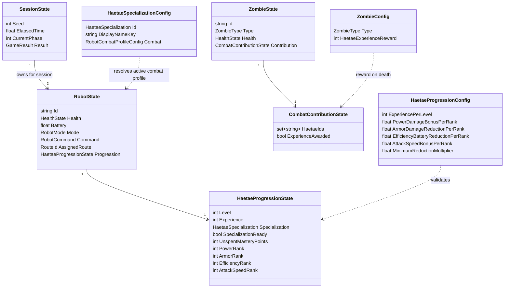
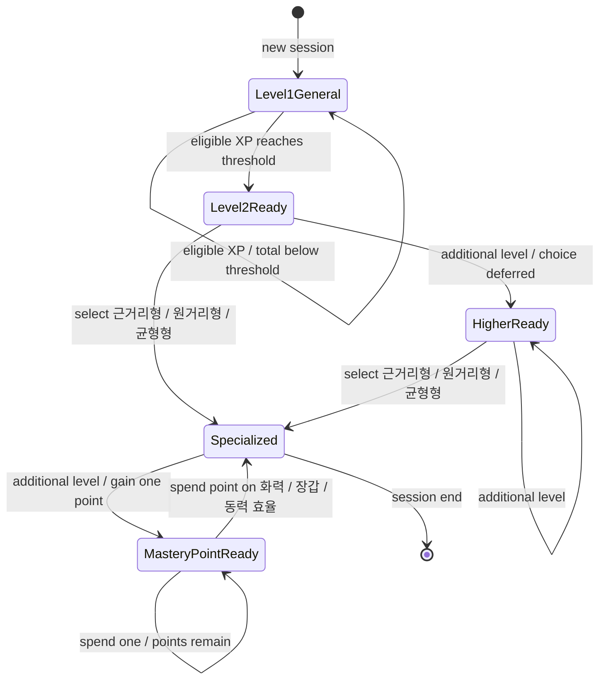
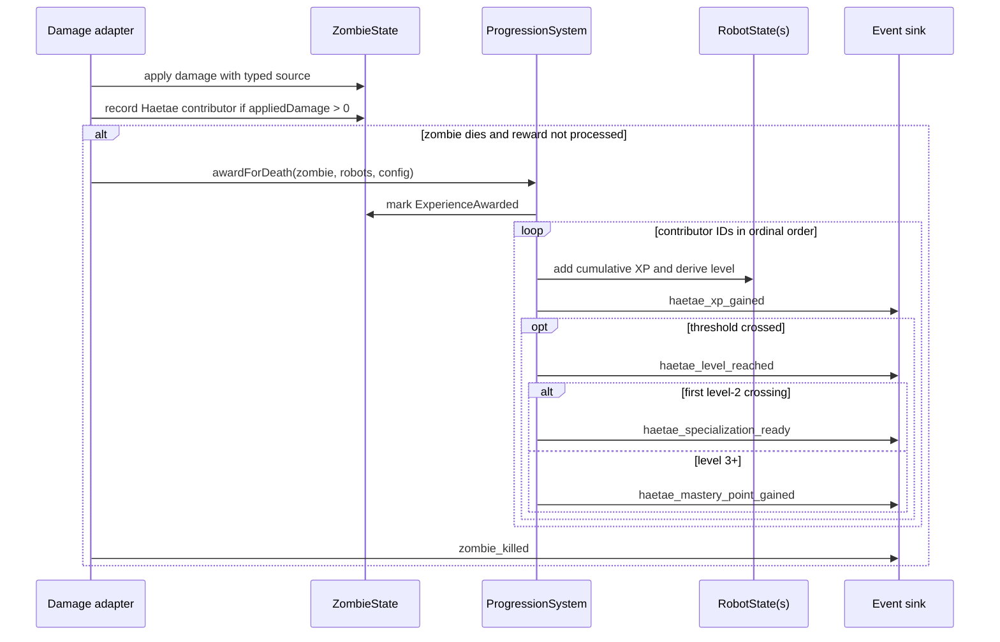

# Data Model: Phase 2 해태 성장·전문화

**Feature**: `002-haetae-build-progression`  
**Data version target**: `mvp-2.0.0`  
**Ownership boundary**: pure state and rules in `Game.Core`; tunable definitions in `Game.Data`; Unity objects are adapters only

## Overview

The model adds an orthogonal progression axis to the existing Haetae combat state. HP destruction, battery state, command, and `RobotMode` continue to answer “can this robot act now?” Progression answers “what has this robot earned and how does it fight?” The two axes never overwrite one another.

## Enumerations

### `HaetaeSpecialization`

| Value | Meaning |
|-------|---------|
| `Unselected` | Level 1 or level 2+ awaiting player choice; uses General profile |
| `Melee` | Player-facing name `근거리형` |
| `Ranged` | Player-facing name `원거리형` |
| `Balanced` | Player-facing name `균형형` |

`Unselected` is not a fourth selectable specialization.

### `HaetaeMasteryUpgrade`

| Value | Meaning |
|-------|---------|
| `Power` | `화력 강화`; all Haetae attack damage +10% per rank |
| `Armor` | `장갑 강화`; incoming damage -8% per rank, multiplier floor 0.50 |
| `Efficiency` | `동력 효율`; combat battery drain -8% per rank, multiplier floor 0.50 |

| `AttackSpeed` | `Attack Speed`; Dash/Bite/Ranged attack interval -10% per rank, multiplier floor 0.50 |

All four upgrades are repeatable. They are not mutually exclusive branches.

### `DamageSourceKind`

| Value | Contribution eligible |
|-------|-----------------------|
| `Player` | No |
| `Haetae` | Yes, when applied damage is positive |
| `Environment` | No |
| `Debug` | No |
| `Other` | No |

### `RobotMovementIntent`

`Approach`, `Hold`, `Retreat`, `ReturnToCommandAnchor`, `None`.

### `RobotAttackKind`

`None`, `Dash`, `Bite`, `Ranged`.

These enums describe pure decisions; they do not add `RobotMode` values.

## Runtime State

### `HaetaeProgressionState`

| Field | Type | Initial | Rule |
|-------|------|---------|------|
| `Level` | int | 1 | Derived as `1 + floor(Experience / ExperiencePerLevel)` |
| `Experience` | int | 0 | Non-negative cumulative session XP; overflow is preserved |
| `Specialization` | enum | `Unselected` | Once set to Melee/Ranged/Balanced, immutable for session |
| `SpecializationReady` | derived bool | false | `Level >= 2 && Specialization == Unselected` |
| `UnspentMasteryPoints` | int | 0 | Gains one for each level crossed above 2; cannot be spent before specialization |
| `PowerRank` | int | 0 | Increments when a Power point is spent |
| `ArmorRank` | int | 0 | Increments when an Armor point is spent |
| `EfficiencyRank` | int | 0 | Increments when an Efficiency point is spent |
| `AttackSpeedRank` | int | 0 | Increments when an Attack Speed point is spent |

Lifecycle:

- Created once with the containing `RobotState` at session start.
- Preserved through phase transitions, battery disable/recovery, HP destruction, and phase-start restore.
- Discarded only when the session ends/restarts.

### `CombatContributionState`

| Field | Type | Initial | Rule |
|-------|------|---------|------|
| `HaetaeIds` | unique string collection | empty | Add only known Haetae source IDs with positive applied damage |
| `ExperienceAwarded` | bool | false | Set before publishing award results to prevent duplicate payouts |

The collection is sorted with ordinal string comparison before award processing. Storage order is not treated as event order.

### `DamageSource`

| Field | Type | Rule |
|-------|------|------|
| `Kind` | `DamageSourceKind` | Required |
| `SourceId` | string | Required and must match a known robot when `Kind == Haetae`; may be empty for non-entity environment/debug damage |

### `RobotAttackResult`

| Field | Type | Meaning |
|-------|------|---------|
| `Kind` | `RobotAttackKind` | Attack selected this step |
| `Damage` | float | Damage per affected target |
| `Range` | float | Maximum valid distance |
| `CooldownSeconds` | float | Cooldown applied after the attack |
| `AreaRadius` | float | 0 for single target |
| `MaximumTargets` | int | 1 for single target; Melee cleave baseline 3 |

### `RobotCombatDecision`

| Field | Type | Meaning |
|-------|------|---------|
| `Movement` | `RobotMovementIntent` | Approach/hold/retreat decision for current distance |
| `Attack` | `RobotAttackResult` | May be `None` while moving/cooling down |

The decision function reads robot progression, battery multipliers, current distance, cooldowns, and active profile. It does not read Unity transforms or physics.

## Configuration Model

### `HaetaeProgressionConfig`

| Field | Initial planning value | Validation |
|-------|------------------------|------------|
| `ExperiencePerLevel` | 75 | Positive |
| `ReadyAlertSeconds` | 4 | Positive; presentation only |
| `PowerDamageBonusPerRank` | 0.10 | Positive |
| `ArmorDamageReductionPerRank` | 0.08 | Positive |
| `EfficiencyBatteryReductionPerRank` | 0.08 | Positive |
| `MinimumReductionMultiplier` | 0.50 | Greater than 0 and at most 1 |

### Zombie XP additions

| Zombie | `HaetaeExperienceReward` |
|--------|--------------------------|
| Runner | 5 |
| Bruiser | 25 |
| Ripper | 20 |

Every reward is positive. The zombie definition is the single owner; progression config must not duplicate these values.

### `RobotCombatProfileConfig`

| Field | General | Melee | Ranged | Balanced |
|-------|---------|-------|--------|----------|
| `AttackMode` | melee | melee-cleave | ranged | hybrid |
| `PreferredMinRange` | 0 | 0 | 6 m | 0 |
| `PreferredMaxRange` | 2 m | 2 m | 12 m | 8 m |
| `DashDamageMultiplier` | 1.0 | 4.0 | 0 | 2.5 |
| `BiteDamageMultiplier` | 1.0 | 4.0 | 0 | 2.5 |
| `RangedDamage` | 0 | 0 | 200 | 190 |
| `RangedCooldownSeconds` | N/A | N/A | 0.35 | 0.35 |
| `CleaveRadius` | 0 | 2.5 m | 0 | 0 |
| `MaximumTargets` | 1 | 3 | 1 | 1 |
| `IncomingDamageMultiplier` | 1.0 | 0.70 | 1.15 | 1.0 |
| `CombatBatteryMultiplier` | 1.0 | 1.20 | 1.0 | 0.90 |

All values are planning baselines and may move during balancing, but their ownership and validation rules are fixed.

Balanced does not duplicate a separate melee-switch field: it uses the existing chassis melee range from `RobotDefinitionAsset` (2 m in the planning baseline) as the ranged-to-melee transition threshold.

### Specialization presentation

Each specialization definition also owns greybox-only presentation fields:

- `DisplayNameKey`
- `DescriptionKey`
- `BodyColor`
- `ScaleMultiplier`
- `AttackPulseColor`
- `TracerColor`

Presentation values never affect deterministic outcomes.

### `SimulationRunOptions`

| Field | Type | Rule |
|-------|------|------|
| `SpecializationLoadout` | ordered pair of `HaetaeSpecialization` | Optional run override; entry 1 targets Haetae 1 and entry 2 targets Haetae 2 |

`SimPlayerProfileConfig` owns an ordered two-entry default loadout for normal unattended runs. Balance matrices and A/B comparisons pass `SimulationRunOptions.SpecializationLoadout` explicitly so all nine ordered combinations can run against the same player profile without mutating shared configuration. The override is simulation input, not gameplay balance data, and reading it never advances spawn RNG.

### Extended phase definition

`PhaseConfig` and its data definition retain the existing composition, route, cadence, group, and concurrent-cap fields and add `OpensNewRoute`.

| Phase | Open routes | Opens new route | Target contribution |
|-------|-------------|-----------------|---------------------|
| 1 | North Road | yes | 35 s |
| 2 | North Road, East Alley | yes | 40 s |
| 3 | all three | yes | 40 s |
| 4–8 | all three | no | 100 s each |

Phase numbers are unique and contiguous from 1 through 8. The final configured phase, not a hard-coded numeric constant, owns the victory transition. Phase 4–8 keep group size `4–6`, group interval `3s`, and concurrent cap `24`; their finite composition ranges make the spawn schedule last approximately the configured target.

## State Transitions

### Progression

Invalid transitions:

- Level 1 directly to a specialization.
- Level 2 ready back to level 1 inside the same session.
- Selected specialization to another specialization.
- Spending a mastery point before specialization or when no point is available.

### Kill and award sequence

### Phase transition after upgrade retirement

1. All planned zombies spawned.
2. Alive count becomes zero after kill/XP processing.
3. Confirm base and player survival.
4. Mark phase clear and recover base.
5. Emit phase-clear samples/radio.
6. If the cleared phase is not the final configured phase, start the next phase immediately.
7. If the cleared phase is Phase 8, end in victory.

Specialization readiness and selection are never transition gates.

## Selection Rules

`SelectSpecialization(robot, requested)` succeeds only when:

- robot exists;
- robot progression level is 2 or higher;
- current specialization is `Unselected`;
- requested value is Melee, Ranged, or Balanced.

Selection is permitted while the robot is Charging, Disabled, Recovery, or Destroyed. If it cannot currently act, the profile becomes observable when normal combat resumes. The selection does not modify `RobotMode`, command, route, HP, battery, or current target.

`SelectMasteryUpgrade(robot, requested)` succeeds only for a specialized robot with at
least one unspent point and consumes exactly one point. Power, Armor, Efficiency, and Attack Speed may
be selected repeatedly in any combination. The build panel and deterministic simulator
never pause combat; simulation auto-spends with a deterministic round-robin policy that
does not consume spawn RNG.

## Relationships with Existing State

- **Destroyed restore**: HP/battery/combat flags restore; progression persists; presentation reapplies the selected profile rather than the original level-1 color.
- **Battery**: active combat profile scales combat drain, then Efficiency scales the result. Idle/patrol/charge rules and Ripper hit drain remain unchanged.
- **Incoming zombie damage**: specialization incoming-damage multiplier applies first, then Armor, before core durability damage.
- **Attack damage**: the role attack result is resolved first, then Power scales all Haetae attack kinds.
- **Attack interval**: the role attack result resolves its Dash/Bite/Ranged interval, then Attack Speed scales it with the same 0.50 floor.
- **Commands**: `DefendPosition`, `PatrolRoute`, and `ReturnToBase` remain the only commands.
- **Targeting**: route and target acquisition rules remain existing behavior; profile changes how a selected target is approached and attacked.
- **Level 2+ unselected**: uses General combat profile and remains fully controllable.

## Invariants

- Exactly two active Haetae progression states exist in a normal session.
- Progression objects have unique non-empty robot IDs through their owning `RobotState`.
- One robot's award or selection never mutates another robot's progression.
- A zombie can grant XP at most once per contributing robot.
- Multiple contributing robots each receive the full reward.
- Player-only/environment-only kills grant no Haetae XP.
- XP is cumulative and never decreases or drops boundary overflow during a session.
- Specialization-ready is raised once when level 2 is first crossed; later levels do not create another specialization choice.
- Every crossed level above 2 grants one mastery point, including multi-level XP awards.
- Unspent points and mastery ranks belong to one Haetae and persist through phases and recovery.
- Armor and Efficiency effective multipliers never fall below 0.50.
- The three specialization IDs are unique and all present.
- Specialization never bypasses battery/Destroyed restrictions.
- Spawn RNG state is independent of specialization and mastery selection.
- Same config, seed, damage order, and selections produce the same XP events and results.

## Data Migration

- Active catalog version advances to `mvp-2.0.0` only in the integration step that also removes active upgrade catalog, UI, runtime, and simulation references.
- Existing runtime sessions are not migrated; progression starts fresh on new session load.
- Old upgrade assets/types may remain serialized but are excluded from active `GameplayConfig`, validation, UI, and simulation.
- Golden telemetry and config snapshots from `mvp-1.4.5` remain historical and are not compared byte-for-byte with `mvp-2.0.0`.
